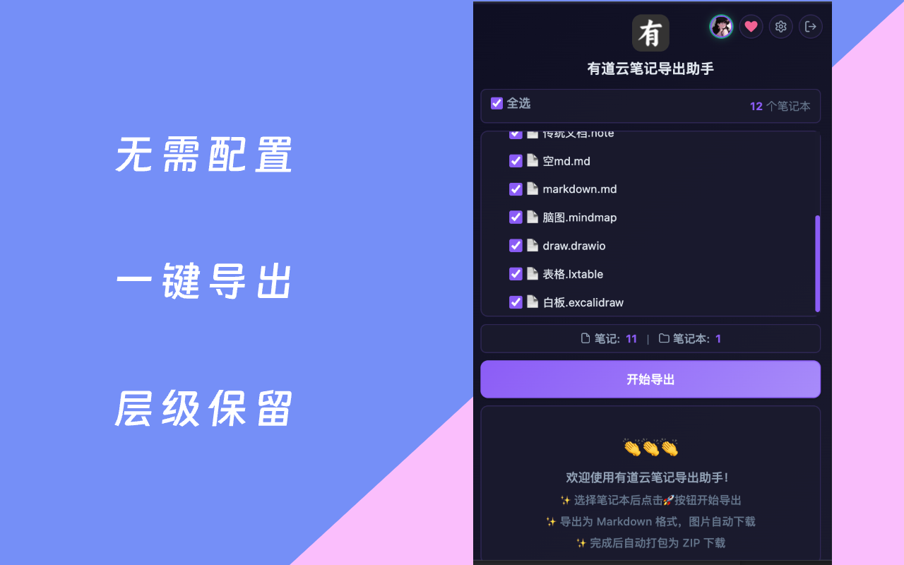

# 有道云笔记导出助手 - Chrome 插件

[](https://github.com/Navyum/chrome-extension-youdao)
[](https://youdao.openmeshx.com)
[](manifest.json)

一个专注于 [有道云笔记](https://note.youdao.com) 的 Chrome 扩展，帮助你一键批量导出笔记为本地 Markdown 备份。工具完全在本地浏览器中运行：读取笔记本树、转换笔记内容、下载图片与白板资源，并按照原有笔记本/文件夹层级打包为 ZIP 文件。

> 免责声明：本项目仅供个人备份、迁移和学习使用。请只导出你有权访问的内容，并遵守有道云笔记及相关平台的服务条款。

## 功能特性

### 核心能力

- **批量导出**：选择笔记本或文件夹后批量导出，无需逐篇复制粘贴。
- **Markdown 输出**：将笔记统一导出为 `.md` 文件，适合长期归档和跨工具迁移。
- **结构保留**：导出的 ZIP 按有道云笔记原始笔记本和文件夹层级组织。
- **资源本地化**：图片、白板 SVG 等依赖资源保存到同级 `assets/` 目录，Markdown 使用本地相对路径。
- **特殊格式转换**：支持表格、思维导图、Draw.io、Excalidraw、图片文件等常见有道格式。

### 使用体验

- **自动鉴权**：保持浏览器登录 `note.youdao.com` 即可，无需手动复制 Cookie 或 Token。
- **后台执行**：关闭弹窗不会中断导出任务，重新打开可查看进度。
- **ZIP 打包**：导出完成后自动生成一个可下载的 ZIP 文件。
- **失败记录**：单篇笔记失败不会阻塞整体导出，可在结果中追踪失败项。
- **双语界面**：内置中文和英文 Chrome i18n 文案。

### 安全可控

- **本地处理**：转换和打包都在浏览器扩展本地完成，不上传笔记内容到第三方服务器。
- **最小用途权限**：使用 `cookies` 读取登录状态，`storage` 保存任务进度，`downloads` 下载 ZIP。
- **只读导出**：扩展只读取数据并转换格式，不会修改或删除有道云笔记中的原始内容。

## 界面预览

| 弹窗 | 目录结构 | 特殊格式 |
| --- | --- | --- |
|  |  |  |

## 安装

### 方式一：拉取源码，开发者模式加载

```bash
git clone https://github.com/Navyum/chrome-extension-youdao.git
cd chrome-extension-youdao
npm install
npm run build
```

然后在 Chrome 中加载构建产物：

1. 打开 `chrome://extensions/`。
2. 右上角开启“开发者模式”。
3. 点击“加载已解压的扩展程序”。
4. 选择本项目生成的 `dist/` 目录。

### 方式二：自打包

```bash
npm install
npm run build
npm run pack
```

生成的安装包位于：

```text
build/youdaonote-export.zip
```

## 快速开始

1. **登录有道云笔记**  
   使用桌面 Chrome 打开 [https://note.youdao.com](https://note.youdao.com)，保持登录状态。

2. **打开插件弹窗**  
   点击浏览器工具栏上的扩展图标，确认弹窗 UI 正常加载。

3. **加载笔记本**  
   点击“加载笔记本”，扩展会读取当前浏览器登录状态并加载笔记本树。

4. **选择导出范围**  
   勾选需要导出的笔记本或文件夹。首次使用建议先选择一个小文件夹试导出。

5. **开始导出**  
   点击“开始导出”，等待任务完成。关闭弹窗不影响后台任务。

6. **下载 ZIP**  
   导出完成后浏览器会下载 ZIP。解压后即可得到 Markdown 文件和同级 `assets/` 资源目录。

## 登录要求

扩展运行时会读取浏览器中有道云笔记相关 Cookie，用于复用你的登录状态：

- 如果提示未登录，请先打开 [note.youdao.com](https://note.youdao.com) 登录后再尝试。
- 如果长时间未操作导致登录过期，刷新有道云笔记页面或重新登录即可。
- Cookie 仅用于本地请求鉴权，不会被扩展上传或共享。

## 导出格式说明

最终 ZIP 只保留 Markdown 文件和 Markdown 依赖资源：

```text
Notebook/
  Project/
    Meeting.md
    Mindmap.md
    Board.md
    assets/
      Meeting_001.png
      Board.svg
```

| 有道云笔记来源 | 导出结果 | 说明 |
| --- | --- | --- |
| 标准笔记 | Markdown | 转换为 `.md` 文件 |
| Markdown 笔记 | Markdown + assets | 保留 Markdown，并本地化图片 |
| 图片文件 | Markdown 包装 + 本地图片 | 生成引用本地图片的 `.md` 文件 |
| 表格 `.lxtable` | Markdown 表格 | 将单元格内容转换为 Markdown table |
| 思维导图 `.mindmap` | Markdown 大纲 | 将节点树转换为缩进列表 |
| Draw.io | Markdown + SVG | SVG 保存到 `assets/`，Markdown 中引用 |
| Excalidraw | Markdown + SVG | 白板内容输出为 SVG 资源 |

## 迁移建议

| 目标工具 | 建议方式 |
| --- | --- |
| Obsidian | 将解压后的文件夹作为 Vault 打开 |
| Typora | 直接打开导出的 Markdown 文件或文件夹 |
| VS Code | 直接打开导出目录 |
| Notion | 使用 Import 功能分批导入 Markdown |
| Logseq | 将 Markdown 文件整理进目标 graph 工作流 |

## 技术架构

- **Manifest V3** Service Worker：负责后台导出任务和消息调度。
- **Chrome APIs**：`cookies`、`storage`、`downloads`、`runtime`。
- **有道 API 封装**：读取笔记本树、笔记正文和资源数据。
- **转换器**：普通笔记转 Markdown，特殊格式由专门转换器处理。
- **资源本地化**：下载图片和 SVG 资源，重写 Markdown 相对路径。
- **JSZip 打包**：将 Markdown 和 assets 目录构建为最终 ZIP。

## 项目结构

```text
src/
  background.js        扩展 Service Worker
  popup.*              弹窗界面
  settings.*           选项页
  core/                有道 API、转换器、导出器、ZIP 构建器
_locales/              Chrome i18n 文案
assets/                界面资源
icons/                 扩展图标
docs/                  官网、博客、产品和技术文档
```

## 文档

- [官网 & 博客](https://youdao.openmeshx.com)
- [产品说明](docs/PRODUCT.md)
- [技术设计](docs/TECH-DESIGN.md)
- [有道 API 记录](docs/YOUDAO-API-RESEARCH.md)
- [特殊格式说明](docs/SPECIAL-FORMATS.md)
- [Chrome 应用商店描述](docs/WEBSTORE-DESCRIPTION.md)

## 参与贡献

1. Fork & Clone 本仓库。
2. 新建分支并完成修改。
3. 提交前运行 `npm run build` 验证构建。
4. 提交 PR 时说明变更内容、测试方式和影响范围。

欢迎通过 Issue 反馈 bug、兼容性问题或导出格式需求。

## 许可证

本项目默认以 MIT 协议发布。请勿用于违反有道云笔记或第三方平台条款的用途。

## 致谢

- 有道云笔记提供的笔记产品能力。
- Chrome Extension Manifest V3 生态。
- 所有提出反馈、测试特殊格式和贡献建议的用户。

## 赞助支持

如果这个工具帮到了你，欢迎请作者喝杯咖啡。你的支持是项目持续维护的动力，Star 本项目也是一种支持。

| 微信赞赏 | 支付宝 |
| :---: | :---: |
|  |  |

## 相关链接

- [官网 & 博客](https://youdao.openmeshx.com)
- [GitHub 仓库](https://github.com/Navyum/chrome-extension-youdao)
- [问题反馈](https://github.com/Navyum/chrome-extension-youdao/issues)
